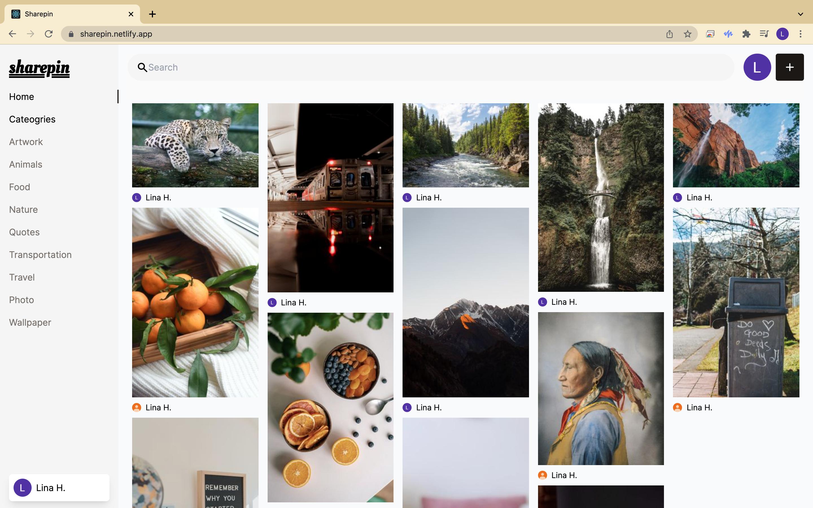

# Sharepin - Image Sharing App

[Sharepin](https://sharepin.netlify.app/) is a photo sharing social media application (inspired by pinterest and unsplash).



## Key Technologies

- node v14.18.1
- npm 6.14.15
- react.js
- google authentication
- sanity.io
- tailwind css
- netlify

## Dev Setup

To get this project running locally, you will need to configure your environment variables in which will require you to create an account with [Sanity](https://www.sanity.io/) and [Google Cloud](https://cloud.google.com/).

### Getting Started

1. Fork or clone this repository
2. `cd sharepin-social-media`
3. Follow 'Backend Setup w/Sanity'
4. Follow 'Frontend Setup w/Google'
5. `cd instashare-frontend`
6. Run `npm start`

### Backend Setup w/Sanity

1. `cd instashare_backend`
2. `npm install -g @sanity/cli`
3. `sanity install`
4. `sanity login`
   - Select login type
5. `sanity init`
   - Select to create new project
     - Enter `(Y)` to use the default dataset configuration.

To start the development server for Sanity Studio, run this command: `sanity start`

Next, you will open the Sanity project management UI where you can add **API token** and **CORS origins**.

In your terminal, run `sanity manage` to get started.

<Details>
  <Summary>Add API Token</Summary>

_API > Tokens > Add API Token_

- Enter a name and select 'Editor' for permissions then save.

</Details>

<Details>
  <Summary>Add CORS origin</Summary>

_API > CORS origins > Add CORS Origin_

- Allow credentials for each of the following origins:
  - http://localhost:3000
  - http://localhost:3333

</Details>

### Frontend Setup w/Google

1. `cd instashare_frontend`
2. `npm install`
3. Create google client ID
   - Visit https://cloud.google.com/ to create a google cloud account.
     - Create a new project and enter project name then create.

<Details>
  <Summary>Create Credentials</Summary>
  
  _APIs & Services > Dashboard > Credentials_

- Click 'Create credentials' > Select 'OAuth client ID' > Click 'Configure consent screen'

  - Select 'external' for user type then create to enter the 'App name' and User support email'.

  - Click 'Add domains' to enter email address then save and continue.

    _Go back to the dashboard > OAuth consent screen_

    - Click 'Publish App' then confirm.

Using your dashboard, navigate to 'Credentials' page to grab your client ID.

> Note: If the OAuth Client ID was not auto-generated, you can manually create it by clicking the 'create credentials' button. For this project, you will select 'application type' as `web application` and add `http://localhost:3000` as the URI. The Client ID will generate once you click the 'create' button.

</Details>

<Details>
  <Summary>Configure Environment Variables</Summary>

To create a new .env file, run `touch .env`

Copy and paste the following variables then configure your environments:

```
REACT_APP_SANITY_TOKEN=
REACT_APP_SANITY_PROJECT_ID=
REACT_APP_GOOGLE_API_TOKEN=
```

</Details>

In `/instashare_frontend`, run this command: `npm start`

http://localhost:3000/login
